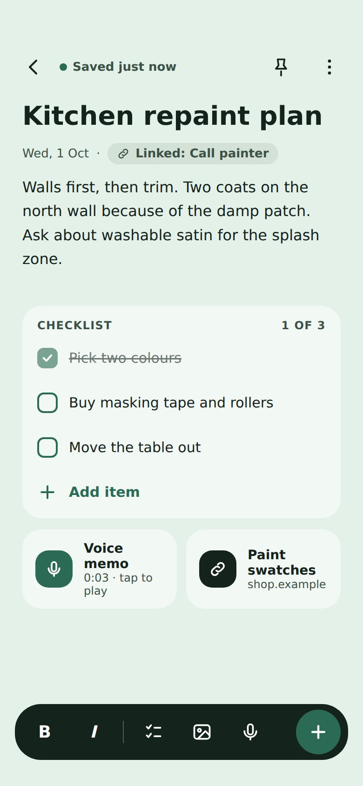
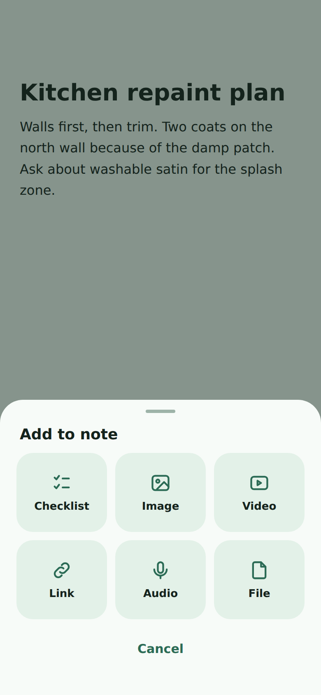

# TaskNest

A local-first Android app for **tasks with reminders** and **notes**, built with Kotlin, Jetpack Compose and Material 3. Create a task, attach notes and a checklist to it, and get reminded on time. Or just use it as a clean notes app. Everything is stored on your device; there is no account and no server.

## Screenshots

> These two images are **design previews** of the note editor, rendered from the UI mockup. They are not captured from a device, and the real app uses the colour theme you pick in Settings. Replace them with real device screenshots when you have them.

| Note editor | Attach sheet |
|---|---|
|  |  |

## Features

### Tasks and reminders
- Tasks with title, description, due date and time, **priority** and **category**
- Per-task **checklist** and attachments
- Attach notes directly to a task
- **Exact-time alarms** with an optional early reminder (5 min to 1 day before)
- Notification actions: **Mark done** and **Snooze**
- Reminders are re-armed after a reboot or app update
- Send a test reminder to check notifications work
- Mark tasks complete, edit and delete them

### Views
- **Today**: today's tasks with category filter and search
- **Calendar**: pick a day and see its tasks
- **Notes**: a staggered grid of your notes with search
- **Settings**: theme, backup and restore
- Floating pill navigation bar and squircle add button

### Notes editor
- Large title and distraction-free body, with **Bold** and *Italic* toggles
- Linked-task chip when a note belongs to a task
- Checklist card that only appears once you add an item
- Attachments: **images, video, links, audio (voice recording) and files**
- Full-screen media preview
- "+" sheet with every attachment type
- Changes are saved automatically

### Look and feel
- Material 3 design with several colour palettes
- Light, dark or follow-system mode
- The editor follows the palette and mode chosen in Settings

### Privacy and locking
- **Lock any task or note.** Only locked items ask for authentication; the app itself opens normally
- Unlock with **fingerprint, face or the device password / PIN / pattern**
- Locked items show only "Locked" in lists and in reminder notifications, and lock again when you leave the app
- Opening, editing and **deleting** a locked item needs authentication
- Locked text, checklists and attachment lists are **encrypted on the device** (AES-256-GCM, key held in the Android Keystore)
- Deleting a note always asks for confirmation first

### Backup and restore
- Export everything (tasks, notes, checklists, settings and media) to a single zip file
- Restore it on the same or another phone, replacing or merging existing data
- If the backup contains locked items, you authenticate once and choose an **export password**. Locked items and their media are encrypted in the file with it
- Restoring such a backup asks for that password first; a wrong password changes nothing

### Other
- Starts empty: no sample tasks or notes
- Works fully offline

## Build

Requirements: JDK 17 or newer and the Android SDK (compileSdk 36). minSdk is 24.

```bash
./gradlew assembleDebug      # APK at app/build/outputs/apk/debug/
./gradlew test               # unit tests
```

## APK builds (GitHub Actions)

`.github/workflows/build-and-release.yml` builds the app automatically:

- On every push or pull request to `main`, it builds a **debug APK** and uploads it as the `TaskNest-APKs` artifact (kept for 30 days). Find it on the workflow run's page under **Artifacts**.
- On a tag such as `v1.0.0`, it also publishes the APK to a GitHub Release.
- Run it manually from the **Actions** tab and choose `debug`, `release` or `both`.
- A signed **release** APK needs these repository secrets: `KEYSTORE_BASE64`, `STORE_PASSWORD`, `KEY_PASSWORD`.

## Project layout

See [PROJECT_INDEX.md](PROJECT_INDEX.md) for a file-by-file map. In short: `data/` (Room database, repository, backup), `notifications/` (alarms), `ui/` (Compose screens, components, theme, view model) and `util/` (audio, biometric auth, encryption).
